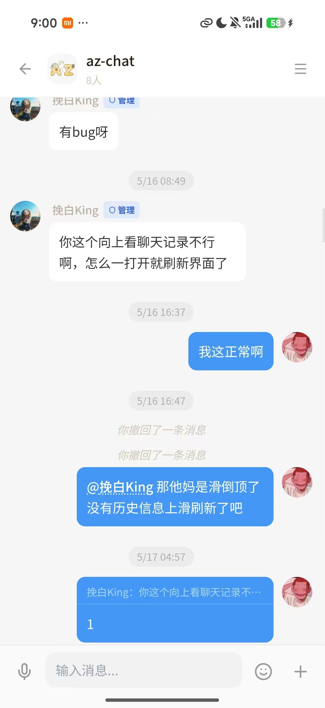
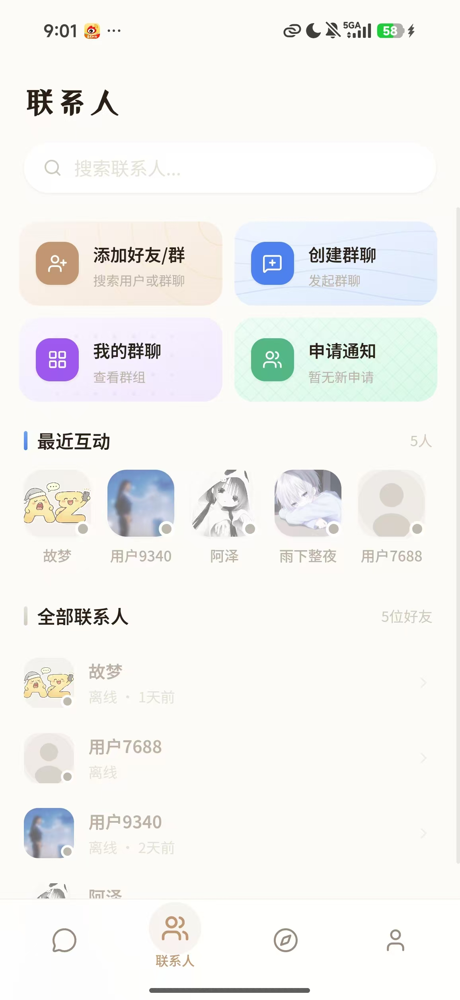
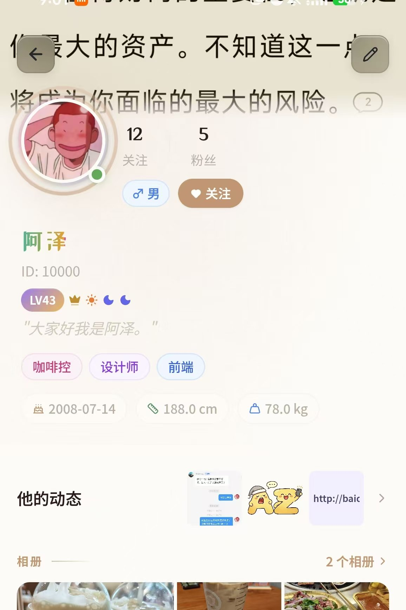
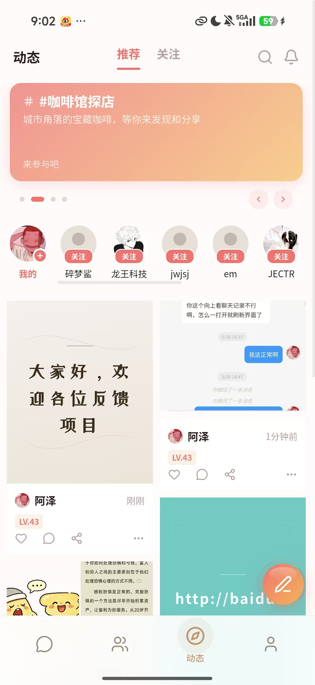

# AZ-Chat v1.1.1

<div align="center">


**全栈实时通讯应用 — 私聊 · 群聊 · 朋友圈 · 相册 · 等级系统 · 管理后台**

[在线 Demo](http://171.80.10.243:5000) · [后端仓库](https://github.com/sbgumen/az-chat-backend) · [Release 下载](https://github.com/sbgumen/az-chat/releases)

</div>

---

## 目录

- [项目截图](#项目截图)
- [为什么选择 AZ-Chat](#为什么选择-az-chat)
- [适合谁用](#适合谁用)
- [功能特色](#功能特色)
  - [多登录方式系统](#多登录方式系统-v110-新增)
  - [即时通讯](#即时通讯)
  - [社交系统](#社交系统)
  - [等级与金币](#等级与金币)
  - [视觉效果](#视觉效果)
  - [安全防护](#安全防护-v110-加强)
  - [管理后台](#管理后台-v110-增强)
  - [账号安全](#账号安全)
  - [推送通知](#推送通知)
- [技术栈](#技术栈)
- [项目结构](#项目结构)
- [快速开始](#快速开始)
- [Android App 打包](#android-app-打包)
- [生产部署](#生产部署)
- [应用配置管理](#应用配置管理)
- [API 概览](#api-概览)
- [版本迭代](#版本迭代)
- [开发路线图](#开发路线图)
- [为什么要开源](#为什么要开源)
- [反馈与共建](#反馈与共建)

---

## 项目截图

<div align="center">
  &nbsp;&nbsp;
  &nbsp;&nbsp;
  
</div>
<br>
<div align="center">
  
</div>

---

## 为什么选择 AZ-Chat

### 你需要的不只是聊天

市面上即时通讯方案很多，但多数要么是闭源的商业 SaaS（数据不可控），要么是功能简陋的开源 Demo（缺后台、缺推送、缺移动端）。**AZ-Chat 填补了这个空白**—— 一套完整的、可私有化部署的、开箱即用的通讯应用。

### 六大核心优势

| 优势 | 解决什么问题 |
|------|-------------|
| **开箱即用** | 10 分钟部署，无需从零开发 IM 系统 |
| **全端覆盖** | Web + Android + 管理后台，一套代码多端运行 |
| **数据自主** | 私有化部署，消息数据 100% 掌握在自己服务器上 |
| **功能完整** | 私聊/群聊/朋友圈/相册/等级 — 社交产品核心功能全部就位 |
| **安全合规** | AES-256 消息加密、JWT 双令牌、审计日志 — 企业级安全标准 |
| **持续迭代** | 活跃开发中，Bug 快速修复，功能按路线图稳步推进 |

### 降低你的决策成本

- **不确定技术栈是否匹配？** → 前端 React + TypeScript，后端 Node.js，全栈 JS 一套通
- **担心部署太复杂？** → 前端静态文件 + 后端 Node 服务，Nginx 反代 3 分钟搞定
- **怕功能不够用？** → 目前已有 30+ 页面、10+ 后端路由模块，覆盖社交通讯核心场景
- **数据迁移顾虑？** → 标准 MySQL 数据库，SQL 导出就能迁移，不做绑定

---

## 适合谁用

| 场景 | 说明 |
|------|------|
| **创业团队** | 快速搭建 IM 原型，验证社交产品想法，省去半年开发时间 |
| **企业内部通讯** | 私有化部署，数据不出公司内网，替代企业微信/钉钉 |
| **垂直社群平台** | 粉丝社区、兴趣小组、行业交流 — 定制专属社交空间 |
| **开发者学习** | 完整的 React/Node.js/Socket.IO 全栈实战项目，代码即教材 |
| **教育/培训** | 师生通讯、作业通知、班级群组 — 教学场景专用沟通工具 |
| **外贸/跨境** | 自建聊天替代 WhatsApp/Telegram，避免被封号断连 |

---

## 功能特色

### 多登录方式系统 (v1.1.0 新增)
- **三种登录方式**：账号密码 / 手机号验证码 / 邮箱验证码，管理后台可独立开关
- **密码注册**：昵称 + 密码自动生成唯一 ID，支持 CAPTCHA 人机验证
- **邮箱登录/注册**：邮件验证码一键登录，自动注册
- **手机号/邮箱绑定**：账号安全页支持独立绑定/换绑

### 即时通讯
- **私聊**：文字、图片、语音，支持消息撤回（2 分钟内）、引用回复、消息收藏
- **群聊**：@提及、群公告、广播通知、群成员管理（禁言/踢出/管理员）
- **会话管理**：置顶、免打扰、未读计数、@提及筛选

### 社交系统
- **好友**：发送/接受/拒绝好友申请，双向好友关系
- **关注**：关注/取关，粉丝/关注列表，关注动态流
- **相册**：创建相册，设置可见范围（公开/好友/私密），评论和收藏
- **朋友圈**：发布/编辑/删除动态，点赞/评论/收藏，话题标签，地理位置

### 等级与金币
- **QQ 四级体系**：星星 → 月亮 → 太阳 → 皇冠（3 进制）
- **多行为经验**：签到、发消息、发动态、发评论、关注、加好友
- **管理端开关**：每种行为可独立启用/禁用，经验值可自定义
- **签到系统**：每日签到 + 连续签到奖励
- **金币系统**：AES-256-GCM 加密存储，原子事务防并发，审计记录完整

### 视觉效果
- **等级头像框**：LV10 渐变边框 / LV20 炫彩边框 / LV30 水晶棱镜
- **LV20/30 入场动画**：GSAP 动效，用户可见升级庆祝
- **6 种主页风格**：鎏金暖阳 / 樱吹雪 / 水晶棱镜 / 极光幻境 / 暗夜霓虹
- **Canvas 粒子背景**：朋友圈/个人主页定制动态装饰

### 安全防护 (v1.1.0 加强)
- **数据加密**：消息、手机号、邮箱、短信模板 ID、SMTP 授权码 AES-256-GCM 加密
- **邮箱加密**：确定性加密支持精确查询，兼容明文旧数据自动迁移
- **双令牌认证**：Access Token 2h + Refresh Token 7d，自动刷新
- **防重放**：Refresh Token 轮换时旧家族全作废
- **HTTPS 兼容**：HTTPS 下使用 HttpOnly Secure Cookie，清缓存不丢登录
- **审计日志**：管理员操作全记录
- **防刷机制**：SMS/邮箱三层限流、Socket 消息限流 30条/分钟、每日经验上限

### 管理后台 (v1.1.0 增强)
- **仪表盘**：实时统计卡片 + 在线人数 + 最近登录
- **用户管理**：创建（昵称+密码自动生成ID）/编辑（含手机号+邮箱）/封禁/删除，搜索
- **登录与注册管理**：三种登录方式独立开关 + 短信模板 ID 配置 + SMTP 邮箱配置 + 测试发送
- **验证码配置**：图形验证码（位数/字母/算数模式 + 实时预览）+ 短信/邮箱验证码（位数/有效期）
- **群聊管理**：编辑/封禁/删除
- **动态管理**：查看/搜索/删除违规动态
- **等级管理**：经验值配置（开关+数值）+ 等级规则表 + 等级分布图
- **话题管理**：编辑/删除话题
- **签到管理**：统计+连续奖励配置
- **预设背景管理**：增删改预设 Banner
- **基础设置**：系统名称/Logo/注册开关/维护公告

### 账号安全
- **修改密码**：旧密码直接修改 / 忘记密码验证重置
- **忘记密码**：自动检测已开启的验证方式（手机号/邮箱），未绑定提示绑定
- **手机号+邮箱双绑定**：独立绑定/换绑，支持不绑定的无验证状态

### 推送通知
- 极光推送（JPush）：App 离线时推送私聊、群聊、好友申请通知

---

## 技术栈

| 层级 | 技术 | 说明 |
|------|------|------|
| 前端框架 | React 19 + TypeScript | 类型安全，组件化开发 |
| 构建工具 | Vite 8 | 极速 HMR，按需编译 |
| 样式方案 | Tailwind CSS 3 + Framer Motion + GSAP | 原子化 CSS + 动效引擎 |
| 实时通信 | Socket.IO 4 | WebSocket + polling 降级 |
| HTTP 客户端 | Axios | 请求/响应拦截，自动刷新 Token |
| 路由 | React Router DOM 7 | SPA 路由，嵌套布局 |
| 移动端 | Capacitor 7（Android） | WebView 原生打包，插件生态 |
| 推送通知 | 极光推送 JPush | 厂商通道（华为/小米/OPPO/vivo 等） |
| XSS 防护 | DOMPurify | 富文本内容过滤 |
| 图片处理 | browser-image-compression + Sharp | 前端压缩 + 服务端压缩 |
| 后端 | Node.js + Express 4 | 异步非阻塞，高并发 |
| 数据库 | MySQL 8 (mysql2/promise) | 连接池 + 原子事务 |
| 认证 | JWT 双令牌 + bcrypt | Access Token 2h + Refresh Token 7d |
| 加密 | AES-256-GCM | 消息/金币/手机号/邮箱/SMTP 授权码 |
| 邮件 | Nodemailer | SMTP 发送邮箱验证码 |

---

## 项目结构

```
AZ-chat/                    # 前端
├── src/
│   ├── pages/
│   │   ├── Login/          # 登录（手机号/邮箱验证码 + 密码 + 注册）
│   │   ├── Messages/       # 消息列表、私聊、群聊、聊天搜索
│   │   ├── Contacts/       # 好友列表、添加好友、好友申请
│   │   ├── Groups/         # 群组管理（创建/邀请/成员管理/公告）
│   │   ├── Moments/        # 朋友圈动态（发布/编辑/搜索/话题）
│   │   ├── Profile/        # 个人主页、设置、等级、相册、金币、账号安全
│   │   └── Admin/          # 管理后台（仪表盘/用户/群聊/动态/等级/签到/预设/话题/验证码/登录与注册/设置）
│   ├── components/         # 公共组件（布局/导航/图片/动画/效果）
│   ├── hooks/              # 自定义 Hook（Socket/陀螺仪/滚动记忆等）
│   ├── api/                # Axios 请求封装
│   ├── utils/              # 工具函数（压缩/剪贴板/等级星星等）
│   ├── context/            # AuthContext + OnlineStatusContext
│   └── styles/             # 全局样式
├── android/                # Capacitor Android 工程
├── screenshots/            # 项目截图
├── index.html              # 入口 HTML
└── .env.example            # 环境变量模板

AZ-chat-后端/               # 后端
├── routes/                 # API 路由（auth/user/messages/contacts/groups/moments/admin 等）
├── socket/                 # Socket.IO 事件处理
├── middleware/              # 中间件（auth/rateLimiter）
├── utils/                  # 工具（加密/钱包/推送/审计/crypto）
├── sql/                    # SQL 初始化脚本
├── config/                 # 数据库连接池
└── app.js                  # 入口（含自动建表+数据迁移+加密初始化）
```

---

## 快速开始

### 环境要求

- Node.js 18+
- MySQL 8+
- Nodemailer（可选，邮箱验证码功能需要）

### 1. 启动后端

```bash
cd AZ-chat-后端
cp .env.example .env    # 编辑 .env，填写数据库密码和生成密钥
npm install
node app.js
# 服务运行在 http://0.0.0.0:5001
# 首次启动自动创建数据库表 + 加密迁移 + 填充默认数据
```

### 2. 配置前端

编辑 `AZ-chat/.env`：

```env
VITE_API_URL=http://localhost:5001
```

### 3. 启动前端

```bash
cd AZ-chat
npm install
npm run dev
# 前端运行在 http://localhost:5000
```

---

## Android App 打包

```bash
cd AZ-chat
npm run sync-config          # 先同步配置
npm run build
npx cap sync android
cd android
.\gradlew.bat assembleDebug
# APK: android/app/build/outputs/apk/debug/app-debug.apk
```

### 图标替换

替换 `android/app/src/main/res/mipmap-*/ic_launcher.png`（各分辨率目录），推荐用 Android Studio 的 Image Asset 工具生成。

---

## 生产部署

### 构建前端

```bash
cd AZ-chat
npm run build
# 产物在 dist/ 目录
```

### Nginx 配置示例

```nginx
server {
    listen 443 ssl;
    server_name your-domain.com;

    location / {
        root /var/www/azchat/dist;
        try_files $uri $uri/ /index.html;
    }
    location /api {
        proxy_pass http://127.0.0.1:5001;
        proxy_set_header Host $host;
        proxy_set_header X-Forwarded-Proto https;
    }
    location /socket.io {
        proxy_pass http://127.0.0.1:5001;
        proxy_http_version 1.1;
        proxy_set_header Upgrade $http_upgrade;
        proxy_set_header Connection "upgrade";
    }
}
```

> 使用 HTTPS 时，Refresh Token 自动使用 HttpOnly Secure Cookie 存储，清除浏览器缓存不会退出登录。

---

## 应用配置管理

所有应用级配置统一在项目根目录 `app.config.json`：

```json
{
  "appName": "AZ Chat",
  "appId": "com.azchat",
  "version": "1.1.1",
  "versionCode": 3,
  "description": "连接你我，温暖每一刻"
}
```

修改后运行同步命令，自动更新所有配置文件：

```bash
npm run sync-config
```

**同步目标文件：** `capacitor.config.ts` → `strings.xml` → `build.gradle` → `package.json` → `index.html`

---

## API 概览

### 认证
| 方法 | 路径 | 说明 |
|------|------|------|
| POST | /api/auth/login | 手机号验证码登录（自动注册） |
| POST | /api/auth/login-id | 账号ID/手机号/邮箱 + 密码登录 |
| POST | /api/auth/login-email | 邮箱验证码登录（自动注册） |
| POST | /api/auth/register | 完成注册（设置昵称） |
| POST | /api/auth/register-password | 纯密码注册（昵称+密码生成ID） |
| GET | /api/auth/check-email | 检查邮箱是否已注册 |
| POST | /api/auth/send-email-code | 发送邮箱验证码 |

### 用户
| 方法 | 路径 | 说明 |
|------|------|------|
| GET | /api/user/profile | 获取个人信息 |
| PUT | /api/user/profile | 更新个人信息 |
| GET | /api/user/search | 搜索用户 |
| POST | /api/user/follow | 关注用户 |
| POST | /api/user/unfollow | 取消关注 |
| GET | /api/user/level | 等级信息 |

### 管理
| 方法 | 路径 | 说明 |
|------|------|------|
| GET | /api/admin/dashboard | 仪表盘 |
| GET | /api/admin/public-settings | 公开设置（含登录方式配置） |
| POST | /api/admin/test-sms | 测试短信发送 |
| POST | /api/admin/test-email | 测试邮件发送 |

---

## 版本迭代

### v1.1.1 (2026-06-08)
- **应用配置系统**：新增 `app.config.json` 中央配置 + `npm run sync-config` 同步脚本，一键更新应用名/版本号/包名
- **Android 打包修复**：修复状态栏双重偏移（改用 `overlaysWebView: true` + Capacitor API 读取真实高度）、图片无法加载（JS fetch 转 blob URL 方案）
- **推送通知升级**：通知支持大图展示（图片消息）+ 点击通知自动跳转对应聊天/申请页
- **Socket 实时通讯修复**：添加 polling 回退 + 断线自动重连 + App 前后台自动切换连接状态
- **图片加载优化**：SafeImg/RemoteImage/ChatImage 全链路 blob URL 预加载 + 骨架屏，去除破图体验
- **消息通知弹窗**：全新毛玻璃 UI，支持私聊/群聊/@/好友申请/群申请多类型，点击跳转
- **关注粉丝列表**：修复签名加密乱码、新增互相关注状态、个人主页关注/粉丝数可点击跳转
- **页面顶部栏统一**：overlay 页面统一 `top: var(--status-bar-height)` 避开状态栏，主页面 header 去重安全区偏移
- **ImageViewer 修复**：图片正常加载 + 顶部状态栏适配
- **群公告头像**：BroadcastPopup / NoticeDetailPage 头像改为 SafeImg 加载
- **邮件验证码**：SMTP 配置管理后台可保存授权码

### v1.1.0 (2026-06-06)
- **多登录方式系统**：支持账号密码/手机号/邮箱三种方式，管理后台可配置开关
- **邮箱登录/注册**：SMTP 邮件验证码，自动注册，三步注册流程
- **密码注册**：昵称+密码自动生成ID，CAPTCHA 人机验证
- **登录页动态适配**：根据开启的登录方式动态渲染 Tab 和表单
- **管理后台增强**：新增「登录与注册管理」页面，含模板配置+测试发送
- **验证码配置增强**：图形验证码支持算数模式+实时预览；短信/邮箱验证码位数和有效期可配
- **账号安全重构**：支持旧密码直接修改 + 忘记密码验证重置；手机号/邮箱双绑定
- **安全加密扩展**：邮箱加密存储、SMTP 授权码加密、短信模板 ID 加密
- **数据迁移修复**：邮箱渐进加密迁移、phone 列 NULL 约束修复
- **用户管理增强**：支持昵称+密码创建用户，编辑含手机号+邮箱字段

### v1.0.0
- 初始版本，支持手机号验证码登录和 ID+密码登录
- 私聊/群聊/朋友圈/相册/等级系统/管理后台

---

## 开发路线图

### v1.2.0 — 通信增强（计划中）

- [ ] **语音消息**：录音发送 + 波形可视化播放
- [ ] **视频消息**：拍摄/上传短视频，内联播放
- [ ] **文件传输**：支持 PDF/Word/压缩包等文件类型
- [ ] **位置分享**：地图选点 + 位置卡片展示
- [ ] **消息转发**：单条/多条消息转发到其他会话
- [ ] **聊天记录导出**：支持导出为文本/HTML 格式
- [ ] **消息搜索优化**：全文搜索 + 按日期/类型筛选
- [ ] **正在输入状态**：私聊/群聊显示对方正在输入
- [ ] **消息已读回执**：显示消息送达/已读状态

### v1.3.0 — 社交深化（计划中）

- [ ] **语音/视频通话**：WebRTC 一对一音视频通话
- [ ] **群语音/视频通话**：多人实时音视频会议
- [ ] **表情商店**：自定义表情包上传与管理
- [ ] **朋友圈视频**：支持发布短视频动态
- [ ] **朋友圈可见范围**：分组可见 + 指定好友不可见
- [ ] **@好友到朋友圈**：动态中 @ 提及好友
- [ ] **附近的人**：基于地理位置发现新朋友
- [ ] **扫一扫**：扫码添加好友 / 加入群聊

### v1.4.0 — 平台扩展（计划中）

- [ ] **iOS 支持**：Capacitor iOS 原生打包 + 极光推送 iOS 适配
- [ ] **桌面端**：Electron 桌面应用（Windows/macOS）
- [ ] **PWA 支持**：Service Worker 离线缓存，添加到桌面
- [ ] **平板适配**：Pad 端横屏布局 + 分栏视图
- [ ] **多端消息同步**：登录多个设备，消息实时同步
- [ ] **暗黑模式**：全局自动/手动暗黑主题切换

### v2.0.0 — 生态构建（远期规划）

- [ ] **AI 智能助手**：ChatBot 集成，智能回复建议、消息摘要
- [ ] **红包系统**：个人红包 / 群拼手气红包
- [ ] **支付集成**：钱包充值、金币交易、打赏功能
- [ ] **小程序平台**：开放 API，第三方小程序接入
- [ ] **频道/广播**：一对多内容推送，订阅制频道
- [ ] **内容审核**：AI 自动审核敏感内容（图片/文字/视频）
- [ ] **数据大屏**：管理后台可视化数据看板
- [ ] **国际化**：多语言支持（英文 / 日文 / 韩文）

---

## 为什么要开源

### 真实想法

AZ-Chat 不是一个"玩具项目"，而是作者投入了大量时间打磨的全功能通讯应用。选择开源的原因很简单：

**1. 让更多人用上好用的 IM 工具**

市面上的即时通讯要么是微信/QQ 这类封闭大厂产品，要么是 Slack/Teams 这类面向企业的付费工具。普通人、小团队想要一套自己的通讯系统，选择极少。AZ-Chat 想填补这个空白。

**2. 代码即最好的简历**

对于开发者来说，一套完整的全栈通讯应用是最好的技术名片。从 React 组件设计到 Socket.IO 实时通信，从 JWT 鉴权到 AES 加密，每一行代码都在证明能力。

**3. 社区驱动，共建共赢**

一个人的想法有限，一群人的智慧无限。开源后，用户反馈真实需求，开发者贡献代码，项目才能走得更远。

**4. 技术沉淀与传承**

React 19、Vite 8、WebSocket、WebRTC……前端技术日新月异。AZ-Chat 希望成为全栈开发者的实战参考，让后来者少走弯路。

### 开源不等于免费劳动

代码开源供学习参考，Bug 修复和功能迭代由作者主导维护。如果你觉得这个项目帮到了你，最好的支持方式就是 **提 Bug、提建议、点 Star**。

---

## 反馈与共建

### Bug 反馈

发现 Bug 或使用问题？请通过以下方式反馈，我会第一时间跟进：

- **GitHub Issues**：[提交 Issue](https://github.com/sbgumen/az-chat/issues)
- **反馈格式**：请包含 ① 问题描述 ② 复现步骤 ③ 截图/日志 ④ 环境信息（浏览器/系统/版本）

### 功能建议

有好的想法想让 AZ-Chat 变得更好？欢迎在 [Issues](https://github.com/sbgumen/az-chat/issues) 提出 Feature Request，标注 `enhancement` 标签，我会认真评估并纳入开发路线图。

### 参与贡献

想贡献代码？Fork → 修改 → 提 PR，流程简单直接：

```bash
# 1. Fork 本仓库
# 2. 克隆你的 Fork
git clone https://github.com/YOUR_USERNAME/az-chat.git
cd az-chat

# 3. 创建功能分支
git checkout -b feature/your-feature

# 4. 修改代码，提交
git add .
git commit -m "feat: add your feature"
git push origin feature/your-feature

# 5. 在 GitHub 上提交 Pull Request
```

### 联系作者

如有商业合作、定制开发或其他问题，欢迎通过以下方式联系：

- **邮箱**：2585579144@qq.com
- **GitHub**：[sbgumen](https://github.com/sbgumen)

---

## Star History

如果这个项目对你有帮助，请给一颗 ⭐ Star，这是对我最大的鼓励！

<div align="center">

**[在线 Demo](http://171.80.10.243:5000) · [后端仓库](https://github.com/sbgumen/az-chat-backend) · [提交 Issue](https://github.com/sbgumen/az-chat/issues) · [Release 下载](https://github.com/sbgumen/az-chat/releases)**

</div>
